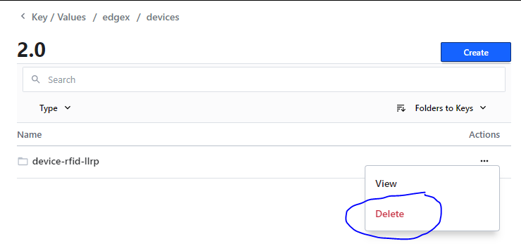

[inventory_service]: https://github.com/edgexfoundry-holding/rfid-llrp-inventory-service

# Device RFID LLRP Go
[](https://jenkins.edgexfoundry.org/view/EdgeX%20Foundry%20Project/job/edgexfoundry/job/device-rfid-llrp-go/job/main/) [](https://codecov.io/gh/edgexfoundry/device-rfid-llrp-go) [](https://goreportcard.com/report/github.com/edgexfoundry/device-rfid-llrp-go) [](https://github.com/edgexfoundry/device-rfid-llrp-go/tags)  [](https://choosealicense.com/licenses/apache-2.0/)  [](https://github.com/edgexfoundry/device-rfid-llrp-go/pulls) [](https://github.com/edgexfoundry/device-rfid-llrp-go/contributors) [](https://github.com/orgs/edgexfoundry/teams/device-rfid-llrp-go-committers/members) [](https://github.com/edgexfoundry/device-rfid-llrp-go/commits)

EdgeX device service for communicating with LLRP-based RFID readers.
This service provides the capabilities to configure and enable LLRP-based RFID readers to generate asynchronous EdgeX readings that contain LLRP ROAccessReport and Reader messages.
A ROAccessReport can be used to examine data read from one or more RFID tags seen by the reader over a given time period, and a ReaderEventNotifications message can be used for data regarding device connection changes, such as attempted connections, connections closed, and errors in a connection.

The [LLRP RFID Inventory Service][inventory_service] can be used to automatically configure this service and readers it manages. This repository also provides a higher-level abstraction for working with RFID tag by parsing ROAccessReports and generating higher-level tag-specific readings (e.g. TAG_APPEARED, TAG_MOVED, etc).

## Table of contents

* [First Run](#first-run)
* [Device Discovery](#device-discovery)
* [Device Profiles, Custom LLRP Messages, and Service Limitations](#device-profiles-custom-llrp-messages-and-service-limitations)
* [Connection Management](#connection-management)
* [Example Scripts](#example-scripts)
* [Testing](#testing)
* [Snap Development and Testing](#snap-development-and-testing)
* [Footnotes](#footnotes)

## First Run
**Build Native**
```bash
make build
```
**Build Docker**
```bash
make docker
```
**Run EdgeX Jakarta**

- [Docker](https://github.com/edgexfoundry/edgex-compose/tree/jakarta)
- [Snap](https://snapcraft.io/edgexfoundry)

**Run device-rfid-llrp**
- [Run via Snap](#snap-development-and-testing)

- Docker
    - Use [compose-builder](https://github.com/edgexfoundry/edgex-compose/tree/jakarta/compose-builder)
    - For non secure mode `make gen ds-llrp no-secty`
    - For secure mode `make gen ds-llrp`
    - `docker-compose -p edgex up -d`
    
- Native

    ```shell
    cd cmd && EDGEX_SECURITY_SECRET_STORE=false ./device-rfid-llrp-go -cp -r
    ```

**Configure subnet information**
>_**Note 1:** This script requires EdgeX and device-rfid-llrp to be running first._

>_**Note 2:** This step is optional if you already configured the subnets beforehand in the configuration.toml file._
```bash
./bin/auto-configure.sh
```
**Trigger a device discovery**

>_**Note 1:** Make sure your LLRP devices are plugged in and powered on before this step_

>_**Note 2:** The system will trigger a discovery 10 seconds after any change is made to the subnet
> or discover port config, so this step is often not required_
```bash
curl -X POST http://localhost:59989/api/v2/discovery
```

At this point the `device-rfid-llrp` service should have discovered your LLRP devices on the network and registered them with EdgeX.

For more detailed info, see [Device Discovery](#Device-Discovery) and [EdgeX Device Naming](#EdgeX-Device-Naming).

## Device Discovery
>_**Note:** Device discovery is currently only compatible with IPv4 networks.
If using an IPv6-only network, you will need to [manually add your devices to EdgeX](#manually-adding-a-device)._

This service has the functionality to probe the local network in an effort to discover devices that support LLRP.

This discovery also happens at a regular interval and can be configured via [EdgeX Consul][consul_discovery] 
for existing installations, and [configuration.toml][config_toml] for default values.

The additional discovery configuration can be modified via the `[AppCustom]` section of the [configuration.toml][config_toml] file.

>_**Note:** Please read the [Notes on configuration.toml](#Notes-on-configurationtoml) for things to be 
aware of when modifying this file._


```toml
[AppCustom]
# List of IPv4 subnets to perform LLRP discovery process on, in CIDR format (X.X.X.X/Y)
# separated by commas ex: "192.168.1.0/24,10.0.0.0/24"
DiscoverySubnets = ""

# Maximum simultaneous network probes
ProbeAsyncLimit = 4000

# Maximum amount of seconds to wait for each IP probe before timing out.
# This will also be the minimum time the discovery process can take.
ProbeTimeoutSeconds = 2

# Port to scan for LLRP devices on
ScanPort = "5084"

# Maximum amount of seconds the discovery process is allowed to run before it will be cancelled.
# It is especially important to have this configured in the case of larger subnets such as /16 and /8
MaxDiscoverDurationSeconds = 300
```

The `DiscoverySubnets` config option defaults to blank, and needs to be provided before a discovery can occur.
The easiest way of doing this is via the following script:
```bash
./bin/auto-configure.sh
```
What this command does is check your local machine's network interfaces to see which ones are both online
and a physical device (instead of virtual). It uses that information to fill in the `DiscoverySubnets` 
field in Consul for you.

>_**Note:** Whenever a change to `DiscoverySubnets` or `ScanPort` is detected via a Consul watcher,
> a discovery is automatically triggered after a 10-second debounced delay._

Discovery can be manually triggered via REST:
```bash
# POST http://<hostname>:<device-rfid-llrp-go port>/api/v2/discovery
curl -X POST http://localhost:59989/api/v2/discovery
```

Every IP address in each of the subnets provided in `DiscoverySubnets` are probed at the specified `ScanPort` (default `5084`). 
If a device returns LLRP response messages, a new EdgeX device is created.

### EdgeX Device Naming
EdgeX device names are generated from information it receives from the LLRP device. 
In the case of Impinj readers, this device name *should* match the device's hostname given by
Impinj, however the hostname information is not available through LLRP, 
so the generated name may differ in certain edge cases.

The device names are generated using the following naming format:
```
<Prefix>-<ID>
```

`<Prefix>` is generated based on the Vendor and Model of the LLRP device. 
If the device is a model with a known naming scheme such as most Impinj readers,
the prefix will be set accordingly, otherwise it will default to `LLRP`.

`<ID>` field is based on the LLRP value `GetReaderConfigResponse.Identification.ReaderID` and can be one of two things. 

If the LLRP device returns a MAC address (`ID_MAC_EUI64`)
for the `GetReaderConfigResponse.Identification.IDType` field, the **last 3 octets**
of the mac address will be used in the following format: `XX-XX-XX`.
So given the following MAC address `00:ef:16:19:fe:16`, the `<ID>` portion of
the device name would be `19-FE-16`.

If the LLRP device returns an EPC (`ID_EPC`)
for the `GetReaderConfigResponse.Identification.IDType` field, the entire 
value of the `GetReaderConfigResponse.Identification.ReaderID` field
is converted into lowercase hexadecimal and used as the `<ID>`. Example: `LLRP-12fec5432453df3ac`

#### Example Device Names by Model
##### MAC based
- **Impinj Speedway R120, R220, R420, R700 and xPortal:**
    - `SpeedwayR-19-FE-16`
- **Impinj xSpan:**
    - `xSpan-19-FE-16`
- **Impinj xArray, xArray EAP and xArray WM:**
    - `xArray-19-FE-16`
- **Other Vendors and Unknown Models**
    - `LLRP-19-FE-16`

##### EPC based
- **Other Vendors and Unknown Models**
    - `LLRP-12fec5432453df3ac`

### Manually Adding a Device
You can add devices directly via [EdgeX's APIs][add_device]
or via the [toml configuration][config_toml], as in the following example:

>_Note: Please read the [Notes on configuration.toml](#Notes-on-configurationtoml) for things to be 
aware of when modifying this file._

```
[[DeviceList]]
  Name = "Speedway"
  Profile = "Device-LLRP-Profile"
  Description = "LLRP RFID Reader"
  Labels = ["LLRP", "RFID"]
  [DeviceList.Protocols]
    [DeviceList.Protocols.tcp]
      host = "192.168.86.88"
      port = "5084"
```

[add_device]: https://app.swaggerhub.com/apis-docs/EdgeXFoundry1/core-metadata/2.1.0#/default/post_device
[config_toml]: cmd/res/configuration.toml
[provision_watcher]: cmd/res/provision_watchers
[impinj_watcher]: cmd/res/provision_watchers/impinj.provision.watcher.json
[generic_watcher]: cmd/res/provision_watchers/llrp.provision.watcher.json
[consul_discovery]: http://localhost:8500/ui/dc1/kv/edgex/devices/2.0/device-rfid-llrp/Device/Discovery/ 

## Device Profiles, Custom LLRP Messages, and Service Limitations
For some use cases, you may want or need to supply your own `deviceProfile`,
but most `LLRP` operations are available via the [included profile][basic_profile].
The section below details how `deviceResources` and `deviceCommands`
are mapped to `LLRP` Messages and Parameters, but first, 
here's what you can and can't do with the default profile: 

- Get the Reader's Capabilities. 
- Get the Reader's Configuration. 
- Set the Reader's Configuration, including custom parameters.
- Add ROSpecs and AccessSpecs, including custom parameters.
- Get the current collection of ROSpecs or AccessSpecs.
- Enable, Start, Stop, Disable, and Delete ROSpecs.
- Enable, Disable, and Delete AccessSpecs.
- Receive ROAccessReports and ReaderEventNotifications
    (the service always sends reports and notifications to EdgeX automatically).

If a Reader returns a response with an `LLRPStatusCode` other than `Success`
(including `ERROR_MESSAGE`, Message Type 100),
then the service decodes any contained `ParameterError`s or `FieldError`s
and returns them as an error with the `LLRPStatus`'s `ErrorDescription`.

The only `LLRP` Message that you _can_ send with a custom profile 
but _can't_ send with the default profile is the `CustomMessage` (Message Type 1023). 
As noted above, you _can_ send `CustomParameter`s (Parameter Type 1023) 
using the default profile when writing Configuration or ROSpecs/AccessSpecs.
Other than that, you may find it useful to create a custom profile 
to bundle multiple read requests, supplying default, 
or mapping special names to `ROSpec`s.

The following `LLRP` operations are _not_ supported at this time:
- When requesting the Capabilities or Configuration, 
    it is not possible to specify the `RequestedData` field
    nor  to append `CustomParameter`s in the request;
    this service always requests `All` data from the Reader.
- There isn't a way to send `GetReport` (Message Type 60),
    which means you should not configure `ROReportSpec`s with a NULL trigger.
- There isn't a way to send `EnableEventsAndReports` (Message Type 64),
    so you should not set `EventsAndReports` to `true` in the `ReaderConfiguration`.
- The service handles connection management and version negotiation,
  so you cannot explicitly send any of these:
  - `CloseConnection` (Message Type 14)
  - `KeepAliveAck` (Message Type 72)
  - `GetSupportedVersion` (Message Type 46)
  - `SetProtocolVersion` (Message Type 47)
- It's not possible to send `ClientRequestOpResponse`,
    so it's not useful to configure a `ClientRequestOpSpec`,
    though we don't explicitly prevent you from doing so.
    There's really no reasonable general-purpose way to support it
    except through code, so if you need it, consider forking this repo
    and adding the interaction by using our [LLRP Library][llrp_library].

A `ProvisionWatcher` is used during the device discovery process to match discovered readers.
It also determines the device profile to be used when adding the new device. The two pre-defined
watchers are a [generic one][generic_watcher], and one for [Impinj][impinj_watcher]. Any new provision watchers 
added to the same [directory][provision_watcher] will be auto-imported on service startup.

### Data Format
EdgeX requires that `deviceResources` are representable as a basic type,
a homogeneous array of a basic type, or a CBOR "binary" type.
Because `LLRP` Messages and Parameters are [highly structured][llrp_diagram],
this device service maps Specs, Configuration, Capabilities, and Notifications 
to and from JSON-encoded string using `Go`'s `json` package 
and the structures defined in our [LLRP Library][llrp_library].

When a Parameter or Message includes arbitrary data
(e.g., the contents of a tag's `EPC` memory bank or a `CustomParameter` payload),
they're represented in `Go` as a `[]byte`, which `Go` marshals and unmarshals 
as strings representing the base64-encoded data.

For requests to read a `deviceResource` (i.e., a `GET` request), 
the service determines which `LLRP` message to send based upon the resource name.
It marshals the result to JSON and returns it as a string EdgeX `Reading`.
`LLRP` constants are encoded according to the `LLRP` spec 
(e.g., the `StopTriggerType` of an `AISpec` is returned as 0, 1, or 2).
The service uses only the resource name and ignores any attributes it may have;
custom LLRP parameter extensions are not supported for resources read requests, 
nor is the LLRP `CustomMessage` (Message Type 1023).

The following list details the resource names the service recognizes 
and how it satisfies the read request:

- `ReaderCapabilities` sends `GET_READER_CAPABILITIES` (Message Type 1)
    with `RequestedData: All`.
    It returns the resulting `GET_READER_CAPABILITIES_RESPONSE` (Message Type 12).
- `ReaderConfig` sends `GET_READER_CONFIG` (Message Type 2) 
    with `RequestedData: All`, and `AntennaID`, `GPIPort`, and `GPOPort` set to 0.
    It returns the resulting `GET_READER_CONFIG_RESPONSE` (Message Type 12).
- `ROSpec` sends `GET_ROSPECS` (Message Type 26)
    and returns `GET_ROSPECS_RESPONSE` (Message Type 36).
- `AccessSpec` sends `GET_ACCESSSPECS` (Message Type 44)
    and returns `GET_ACCESSSPECS_RESPONSE` (Message Type 44).
    

You can configure `deviceCommands` in your device profile
to read more than one resource at a time,
in which case the device service attempts each of the commands requests in the order
specified by the device profile and returns the results of all of them.

For `LLRP` messages that require only an `ROSpecID` or `AccessSpecID`,
we define them as operations upon `uint32` `deviceResource`s with those names. 
(note that EdgeX requires passing these as strings when calling `deviceCommand`s)
To disambiguate the desired write operation,
`deviceCommands` that use them must specify them as the first resource to `set`,
and must include a "pseudo-resource" called `Action`,
a string which must be one of "Enable", "Disable", "Start", "Stop", or "Delete".
Note that it is not possible in `LLRP` to start or stop an `AccessSpec`,
so those only apply to `ROSpec`s.
Because we must use this pseudo-resource to know what Action to take,
It is not possible to write more than one `deviceResource` at a time.

To add an `ROSpec` or `AccessSpec`, or to set the `ReaderConfig`, 
you can use `deviceCommands` that write a `deviceResource` of the same name 
When you `PUT` a new instance of these resource types,
the service attempts to unmarshal the resource's parameter string 
according to its name into the appropriate 
`LLRP` message structure defined in our [LLRP library][llrp_library].

Unlike read requests, the service handles write requests on `deviceResources`
with names other than those defined above.
It assumes these resources are accessible via `CustomMessage` (Message Type 1023),
and looks for `vendor` and `subtype` attributes on the resource,
which it inserts into the relevant fields of the `LLRP` message.
Although in `LLRP` these are a `uint32` and `uint8` (respectively), 
note that EdgeX requires all attributes values are passed as strings. 
Assuming these are present, the service interprets the parameter string 
as a base64-encoded byte array, which it uses as the `payload` of the `CustomMessage`.

You can see an example [device profile][custom_profile] 
that defines a `deviceResource` to enable Impinj's custom extensions.

[basic_profile]: cmd/res/profiles/llrp.device.profile.yaml
[custom_profile]: cmd/res/profiles/llrp.impinj.profile.yaml
[llrp_library]: internal/llrp/hacking_with_llrp.md
[llrp_diagram]: internal/llrp/LLRPMsgStructure.pdf

## Connection Management
After an LLRP device is added, either via discovery or directly through EdgeX,
the driver works to maintain a connection to it and monitor its health.
When it detects an unhealthy connection, it closes it and redials the Reader.
If it fails to connect two times consecutively,
it sets the device's `OperationState` to `DISABLED`,
but continues to attempt to restore the connection indefinitely.
It'll reattempt the connection using exponential backoff with jitter,
capped to a max of 30 mins between attempts.
If its IP address changes (either manually or via Discovery),
the service attempts to connect to it at the new address.

The device service sets the device to `DISABLED` in EdgeX 
as soon as it thinks it's disabled, but exactly how long this takes
depends on the conditions leading to failure.
Nevertheless, a disconnected device should appear `DISABLED` within about 2 minutes. 

The device service sets a `60s` timeout when reading from OS's TCP connection.
To ensures that a healthy connection will not timeout,
it configures Readers to send `KeepAlive` messages every `30s`.
Because it uses this to monitor the connection health,
it overrides the `KeepAliveSpec` in `SetReaderConfig` requests with its own.

These timeout values are not configurable,
but they are easy to change when building the service 
by changing [this code](internal/driver/device.go).

## Example Scripts
There are a couple of example scripts here
to interact with devices through EdgeX's APIs.
They aren't meant to be perfect or necessarily the best way to do things,
but they should help give examples of what's possible.
They don't do much error handling, 
so don't rely on them for much more than happy-path testing. 

 - [command][]:
    interacts with the commands service
    to get/set LLRP configs and such.
 - [data][]:
    interacts with the data service to view reports and the like. 
 - [read tags example][read_script]:
    runs a "full" example -- sends/enables [`ROSpec`][ro_spec]
    to the first reader that EdgeX knows about,
    waits a bit, disables/deletes it from the reader,
    then displays any collected tags.

They assume everything is running and expect you have a these on your path:
`jq`, `curl`, `sed`, `xargs`, `base64`, and `od`. 
By default, they all try to connect to `localhost` on the typical EdgeX ports.
`command.sh` and `data.sh` take args/options; use `--help` to see their usage.
`example.sh` uses a couple of variables defined at the top of the file
to determine which host/port/file to use.

The [command][] script in particular shows some examples in its `usage`.
You can use it to control arbitrary LLRP configuration,
such as adding/modifying/removing `ROSpec`s and `AccessSpec`s, 
changing a Reader's default `ROAccessReport` reported data,
enabling/modifying/disabling `KeepAlive` messages,
and enabling/disabling specific `ReaderEventNotification`s.

[command]: examples/command.sh
[data]: examples/data.sh
[read_script]: examples/example.sh
[ro_spec]: examples/ROSpec.json

## Testing
There are many unit tests available to run with the typical `go` tools.
`make test` executes `go test ./... -coverprofile=coverage.out` 
and so can be used to quickly run all tests and generate a coverage report.

### LLRP Functional Tests
There are some tests in the `internal/llrp` package 
which expect access to a reader.
By default, they're skipped.
To run them, supply a `-reader=<host>:<port>` argument to Go's test tool.
For example, from the `internal/llrp` directory,
you can run `go test -reader=192.0.2.1:5084`;
assuming an LLRP device is reachable at that IP and port,
it will connect to it, get its config and capabilities,
then try to send and enable/start a basic `ROSpec`.
It waits a short time, possibly collecting `ROAccessReport`s
(assuming tags are in your reader's antennas' FoVs),
and the disables/deletes the `ROSpec`.
The full options it will respond to:

- [`short`](https://golang.org/pkg/testing/#Short) 
    skips the `ROSpec` test described above, 
    since it takes a little while to wait for the reports.
- [`verbose`](https://golang.org/pkg/testing/#Verbose) 
    logs some extra marshaling/unmarshaling data.
- `reader` sets an address of an LLRP device and runs functional tests against it.
- `ro-access-dir` uses a different subdirectory of 
    `internal/llrp/testdata` (by default, `roAccessReports`)
    when running `TestClient_withRecordedData`.
    See below for more info.
- `update` is used in the context of functional tests, 
    but [is only needed in special circumstances](#updating-recorded-test-data)
    and should not be used unless you understand the consequences.
    

Note that if you're using the Goland IDE, 
you can put these options in a test config's `program arguments`,
though the `short` and `verbose` options need the `test.` prefix. 

### Recorded Data Tests
The `internal/llrp/testdata` folder contains a series of `.json` and `.bytes` files.
They're used by [the `TestClient_withRecordedData` unit test][data_tests]
which uses them roughly as follows: 

1. Convert `.json` -> `struct 1` -> `new bytes`
1. Convert `.bytes` -> `struct 2` -> `new JSON`
1. Compare `.json` and `new JSON`
1. Compare `.bytes` and `new bytes`

The test only passes if the unmarshaling/comparisons are successful,
which assumes it's able to match the name to an LLRP message type
(it'll print an error if it doesn't have a match). 
Files in that directory only need to match the format
`{LLRP Message Type}-{3 digits}.{json|bytes}`;
other file names are ignored.
The message name must also be specified in the test's `switch`,
or it'll show an error about not finding a matching message type. 

The test runs the same process using files in `roAccessReports` subdirectory,
which just makes it a little easier to organize those files.
You can use a different test directory with different reports
by using the `ro-access-dir` flag while running that test,
but the alternative directory must be a subdirectory of [`testdata`](internal/llrp/testdata).

For example, to run the test with files in a `testdata/giantReports` directory:

`go test -v -run ^TestClient_withRecordedData$ -ro-access-dir=giantReports`


By default, this directory is set to `roAccessReports`.
If you set it to `""`, it'll skip checking it entirely.

There's actually nothing special about the directory name nor this flag
that requires its contents be `ROAccessReport` message specifically, 
so you're free to segment other json/binary message file pairs
into various directories and rerun the test with appropriate flag values. 
As long as the filenames match the pattern described above
and that name is in the `switch` block of the `compareMessages` function 
of [the test][data_tests] it'll test them.

#### Updating Recorded Test Data
As the test name implies, the `.bytes` data is recorded from an actual reader.
It's possible to use the included Functional tests 
to record new data by passing the `-update` flag.
Under most circumstances, this isn't necessary 
(some cases where it is are described below).

When `-update` is `true`, the [`TestClientFunctional` test][functional_tests] 
skips its normal tests and instead runs the `collectData` function.
That function sends a series of messages to the `-reader` 
and records the binary results in the `testdata` directory,
overwriting existing ones if present (they're version-controlled for a reason).
Most messages are only sent once, hence they'll end in `-000`.
When listening for `ROSpecs`, on the other hand, it'll write as many as it collects.
The [`.gitignore`](.gitignore) is configured to ignore most of them,
but it can be handy for testing.

At present, the recorder ignores the `ro-access-dir` flag described above,
and writes the output directly to the `testdata` directory;
[the data tests](#recorded-data-tests) will happily handle them in `testdata`,
so this can still be fine for testing,
but in the future, it'd probably be better for it to make use of that flag. 

So when is this flag useful?
Basically, if the marshaling/unmarshaling code changes
in a way that results in different JSON/binary interpretation or output.
For the binary side, the format _should_ be fixed,
as its subject to the LLRP specification.
Furthermore, even if the _unmarshaling_ code is wrong,
if the `llrp.Client` code is correctly handling the message boundaries,
the `binary`/`.bytes` files should not have reason to change.

On the other hand, the JSON format is not specific to LLRP.
If the names of keys used in the JSON formats change,
these tests most likely will no longer pass.
For instance, it's possible to implement 
`json.(Unm|M)arshaler`/`encoding.Text(Unm|M)arshaler` interfaces 
to make some LLRP values easier to read.
Doing so may break the `JSON -> Go struct` conversion,
which will result in zero values when going `Go struct -> binary`,
which will change the output. 
In the other direction, the `binary -> Go struct` conversion should be unaffected,
but `Go struct -> JSON` should differ from the recorded value.
The test outputs the location of "first difference" along with some surrounding context
to aid in correcting these tests.
For just name changes, it's probably better to make the changes to the JSON by hand.
However, if the change is large enough, 
it could be easier to just throw away the existing folder and repopulate it.
That is when the `-update` flag makes sense:

`go test -run ^TestClientFunctional$ -reader="$READER_ADDR" -update`

[data_tests]: internal/llrp/reader_data_test.go
[functional_tests]: internal/llrp/reader_functional_test.go

### Test Helpers
There is a [test helper file][test_helper] with some objects/methods
that may be useful when developing unit tests.
The following are particularly useful: 

- `go doc llrp.TestDevice`
- `go doc llrp.GetFunctionalClient`

[test_helper]: internal/llrp/test_helpers.go

## Snap Development and Testing
The Snap directory consists of the `snapcraft.yaml` file and the initialization file `install` for building a snap package for this Service.
### Build Device RFID LLRP Snap Packages
Execute the following commands from the project's root directory. If you try to build elsewhere, it will fail with a `source not found` error message.
- `snapcraft clean`
- `snapcraft`

On success, this creates a `*.snap` package under the root directory. 
The package name format is `{snapName}_{versionNumber}_{architecture}.snap`, e.g.

 `edgex-device-llrp_0.0.0-20201014+39fc566_amd64.snap`

Always delete the old snap package before rebuilding via `rm oldsnap.snap` & `snapcraft clean`. 

To debug snap build issues, run `snapcraft --debug`. 

If snapcraft encounters an error, it will open a shell within the virtualised build environment.
### Install Device RFID LLRP Snap Packages
- `sudo snap install --devmode --dangerous *.snap` 

Use `snapcraft list` to verify the package was installed.
### Test Device RFID LLRP Snap Packages
The service registers itself with consul at initialization,
which requires Consul and other EdgeX Snap packages.

Make sure they are installed and running (`snap install edgexfoundry`),
then start the service with `sudo snap start edgex-device-llrp`
and verify there are no errors in the logs: `sudo snap logs edgex-device-llrp`.

Consul UI can also be used to verify if the service has started without any errors `http://localhost:8500`

Follow [First Run](#first-run) section to auto-configure subnet & trigger device discovery.
As part of testing, registered devices can be checked via EdgeX Core-Metadata API - `http://localhost:59881/api/v2/device/service/name/device-rfid-llrp`

#### Here are other helpful commands:
- List installed Snap packages: `snap list`
- View the Snap service status: `systemctl status snap.edgex-device-rfid-llrp.device-rfid-llrp-go.service`
- View System logs: `journalctl -xe`
- Stop the Snap service: `sudo snap stop edgex-device-rfid-llrp`
- Remove the Snap package: `sudo snap remove edgex-device-rfid-llrp`

## Footnotes
### Notes on configuration.toml
- Modifying the `configuration.toml` file will require you to rebuild the docker image 
and re-deploy using the new image
- Any modifications made to the `configuration.toml` file will be ignored if this is not 
  the first time you have deployed the service and EdgeX Consul is enabled. 
  - Consul will always overwrite any modifications to the toml.
  - To get around this behavior, you may delete the whole configuration group for this
    service within [EdgeX Consul][consul_devices].



[consul_devices]: http://localhost:8500/ui/dc1/kv/edgex/devices/2.0/
